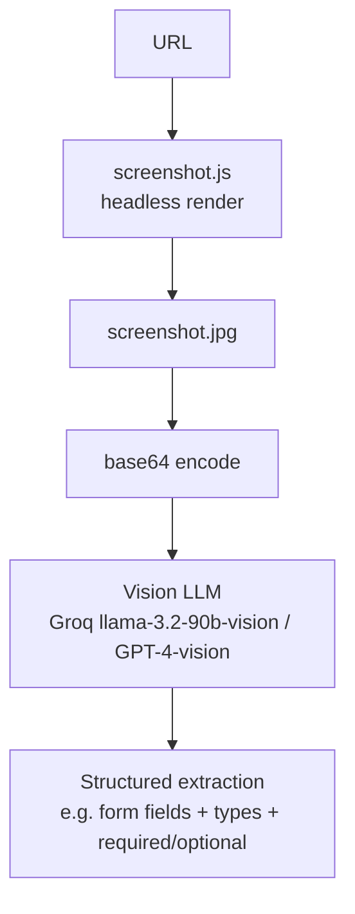

# AI-Web-Scrapper

Takes a URL, screenshots the rendered page, and uses a vision-capable LLM to extract structured information from it — e.g. listing every field on a job-application form with its type, required/optional status, and placeholder text.

## How it works

`Main.py` shells out to `screenshot.js` (a Node script) to render the target URL headlessly and capture `screenshot.jpg`. The image is base64-encoded and sent to a vision model — Groq's `llama-3.2-90b-vision-preview` (with an OpenAI `gpt-4-vision-preview` path also available) — along with a prompt describing what to extract. The model's structured answer is returned as text. `analyzed_structure.png`, `output_with_js.html`, and `output_with_model.html` are leftover artifacts from an earlier version of this project that used OpenCV contour detection + a Hugging Face vision model to reconstruct the page as HTML/CSS/JS instead (now superseded by the simpler vision-LLM approach).



## Architecture

| File | Role |
|---|---|
| `Main.py` | Screenshot capture orchestration + vision-LLM extraction |
| `screenshot.js` | Headless browser screenshot capture (Node) |
| `analyzed_structure.png`, `output_with_js.html`, `output_with_model.html` | Artifacts from a superseded OpenCV + HF-codegen approach |

## Tech stack

Python · Node.js (headless screenshot) · Groq API (vision) · OpenAI API (vision, optional)

## Setup

```bash
npm install
pip install groq openai python-dotenv
# .env: GROQ_API_KEY, OPENAI_API_KEY
python Main.py
```
